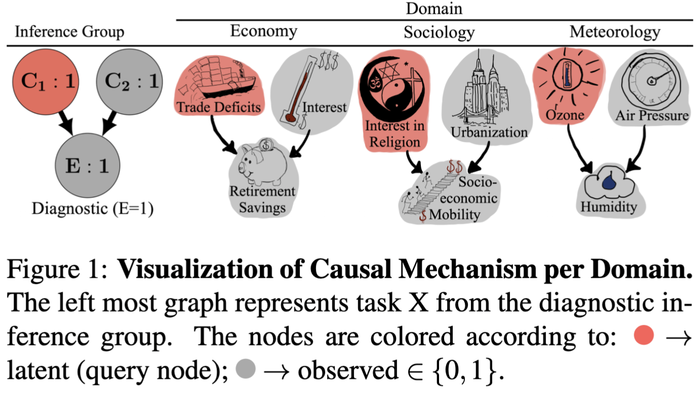
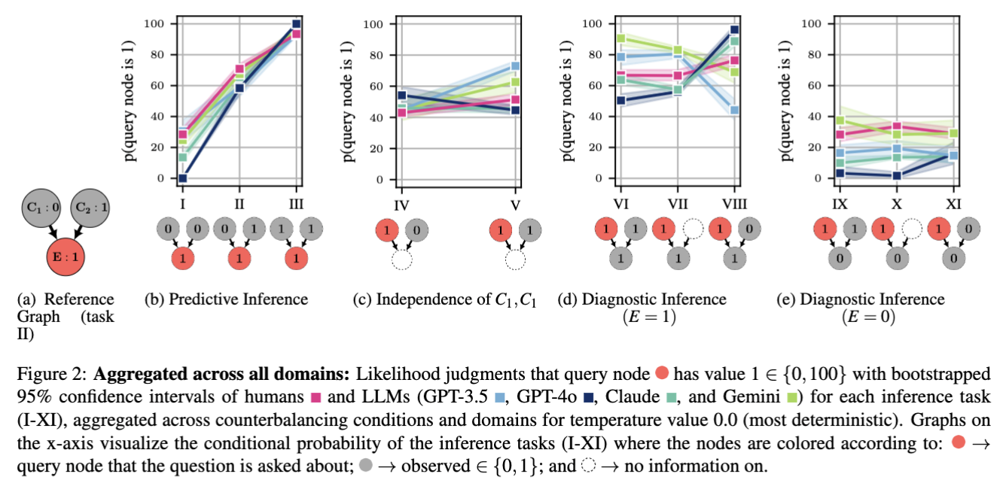

# CausalAlign -- Evaluating Causal Alignment Between Humans and LLMs

## **Overview**

**CausalAlign** is a Python package designed to evaluate the causal reasoning abilities of **Large Language Models (LLMs)** in comparison to **human inference**. It provides tools to systematically assess how LLMs reason about causal structures—particularly **collider graphs** — and whether their judgments align with normative Bayesian inference or human reasoning biases.

This package is based on the work presented in the paper:

> "Do Large Language Models Reason Causally Like Us? Even Better?"
> 
> 
> *Hanna M. Dettki, Brenden M. Lake, Charley M. Wu, Bob Rehder*
> 
> [[arXiv:2502.10215]](https://arxiv.org/pdf/2502.10215)
> 

## **Key Features**

- Implements the **collider causal inference** framework to compare LLMs' and human reasoning.
- Provides tools for **(Spearman) correlation analysis** to measure alignment between human and LLM judgments.
- Fits responses to **Causal Bayesian Networks (CBNs)** to evaluate normative reasoning.
- Supports API calls for multiple LLMs, including **GPT-4o, GPT-3.5, Claude-3-Opus, and Gemini-Pro**.
     - for the dataset constructed based on experiment 1 (model-only condition) from [Rehder&Waldmann, 2017](https://link.springer.com/article/10.3758/s13421-016-0662-3).
     - dataset: TODO


## **Installation**

To install the package, clone the repository and install dependencies:

```bash
git clone <https://github.com/yourusername/causalalign.git>
cd causalalign
pip install -e .

```

If you want to install directly from a public GitHub repository:

```bash
pip install git+https://github.com/yourusername/causalalign.git

```

## **Usage**

```bash
TODO
```


## **Data and Models**

CausalAlign provides support for evaluating LLMs across different causal inference tasks. It is particularly apt for datasets building on experiments in  [Rehder&Waldmann, 2017](https://link.springer.com/article/10.3758/s13421-016-0662-3).


It includes built-in support for:

- **Human data from Rehder & Waldmann (2017), experiment 1, model-only condition**
- **LLM inference responses (GPT-4o, GPT-3.5, Claude-3-Opus, and Gemini-Pro)**

## **Some Benchmarking Results:**


### **Paper Summary: "Do Large Language Models Reason Causally Like Us? Even Better?"**

Large Language Models (LLMs) have demonstrated impressive reasoning capabilities, but do they **reason causally like humans**? This study investigates whether LLMs exhibit **human-like causal reasoning**, whether they follow **normative Bayesian inference**, or whether they introduce **unique biases**.

The study compares human judgments with four LLMs (**GPT-4o, GPT-3.5, Claude-3-Opus, and Gemini-Pro**) on **causal inference tasks** based on **collider structures** (e.g., `C1 → E ← C2`) embedded in three different knowledge domains (economy, sociology, meteorology) based on the cover stories introduced in Rehder & Waldmann /2017:




The results show:

- **Claude-3-Opus and GPT-4o** were the most **normative**, showing strong **explaining away** behavior.
- **GPT-3.5 and Gemini-Pro** exhibited more **associative biases**, resembling human errors.
- LLMs often **overestimated causal strengths** compared to human participants.
- LLMs relied more on **domain knowledge** than humans, sometimes leading to **non-normative responses**.




This work underscores the need to evaluate LLMs’ reasoning **beyond pattern recognition**, ensuring they make **reliable causal inferences** in **real-world applications**.

For more details, refer to the full paper: [[arXiv:2502.10215]](https://arxiv.org/pdf/2502.10215).

Table: Spearman correlations (**rₛ**) between **human** and **LLM** inferences.

| Model | Economy (rₛ) | Sociology (rₛ) | Weather (rₛ) | Pooled across all domains (rₛ) |
| --- | --- | --- | --- | --- |
| **Claude** | 0.557 | **0.637 | **0.698** | **0.631** |
| **GPT-4o** | **0.662** | 0.572 | 0.645 | **0.626** |
| **GPT-3.5** | 0.419 | 0.450 | **0.518** | 0.462 |
| **Gemini** | 0.393 | 0.297 | **0.427** | 0.372 |


## **Citation**

Please cite paper as:

```
@misc{dettki2025largelanguagemodelsreason,
  title         = {Do Large Language Models Reason Causally Like Us? Even Better?},
  author        = {Hanna M. Dettki and Brenden M. Lake and Charley M. Wu and Bob Rehder},
  year          = {2025},
  eprint        = {2502.10215},
  archiveprefix = {arXiv},
  primaryclass  = {cs.AI},
  url           = {https://arxiv.org/abs/2502.10215}
}
```
